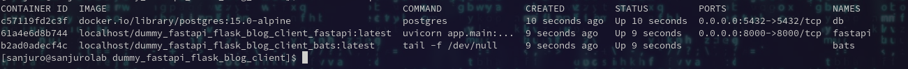
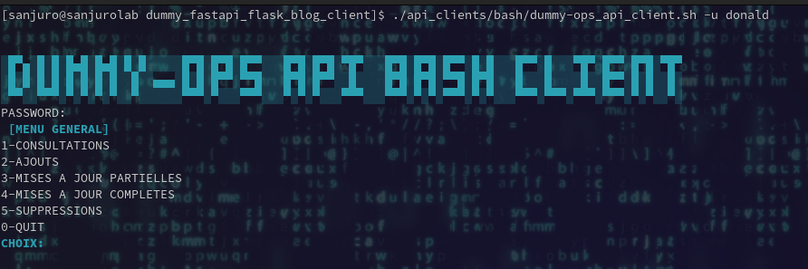

# DUMMY REST API CLIENTS FOR LEARNING PURPOSES
**These are dummy clients for a dummy blog application.**

We set several clients using different languages for learning purposes. Bash is the first one, others are coming.

The "dummy blog application" project is clone as a submodule.

This "dummy blog application" Github project is at: https://github.com/memphis-tools/dummy_fastapi_flask_blog_app

## TECHNOLOGIES

bats >= 1.8.2-1

jq => 1.6-14

## HOW USE IT

Clone the repository:

    git clone --recurse-submodules https://github.com/memphis-tools/dummy_fastapi_flask_blog_client.git

    cd dummy_fastapi_flask_blog_client

Ensure the submodule project is refreshed:

    git submodule update --remote

Set a local .env file with something like this:

    SCOPE="local_test"
    POSTGRES_USER="postgres"
    POSTGRES_PASSWORD="postgres"
    POSTGRES_TEST_DB_NAME="test_dummy_blog"
    POSTGRES_PORT="5432"
    POSTGRES_HOST="db"
    ADMIN_LOGIN="admin"
    ADMIN_PASSWORD="@pplepie94"
    ADMIN_EMAIL="admin@localhost.fr"
    TEST_USER_PWD="@pplepie94"
    SECRET_KEY="thisIsADummySecretKeyJustSetForFastApiToRun"
    API_URL="http://fastapi:8000/api/v1"
    DUMMY_USERNAME="donald"
    DUMMY_PASSWORD="@pplepie94"

As the clients need a running dummy blog api, you first clone the repository and build the services:

    docker-compose -f docker-compose.yml up -d --build

  

The application will be build with dummy datas to be tested (users, books etc).

Run the BASH client. We use credentials from a dummy user already created (donald / @pplepie94).

    ./api_clients/bash/dummy-ops_api_client.sh -u donald

  

## HOW RUN TESTS LOCALLY

**Run bats tests against the shell client**:

    docker exec bats bats 01-test_dummy_fastapi_token_routes.bats

    docker exec bats bats 02-test_dummy_fastapi_book_routes.bats

    .., and so on (see ./api_clients/bash/ folder)

## USEFULL LINKS

For git submodules:

https://git-scm.com/book/en/v2/Git-Tools-Submodules

For jq:

https://stackoverflow.com/questions/63739082/jq-accepts-invalid-json-input-when-it-should-throw-an-error

https://stackoverflow.com/questions/18592173/select-objects-based-on-value-of-variable-in-object-using-jq

https://stackoverflow.com/questions/39139107/how-to-format-a-json-string-as-a-table-using-jq

https://unix.stackexchange.com/questions/750864/how-to-format-a-json-string-as-a-table-using-jq

For bats:

https://bats-core.readthedocs.io/en/stable/docker-usage.html
